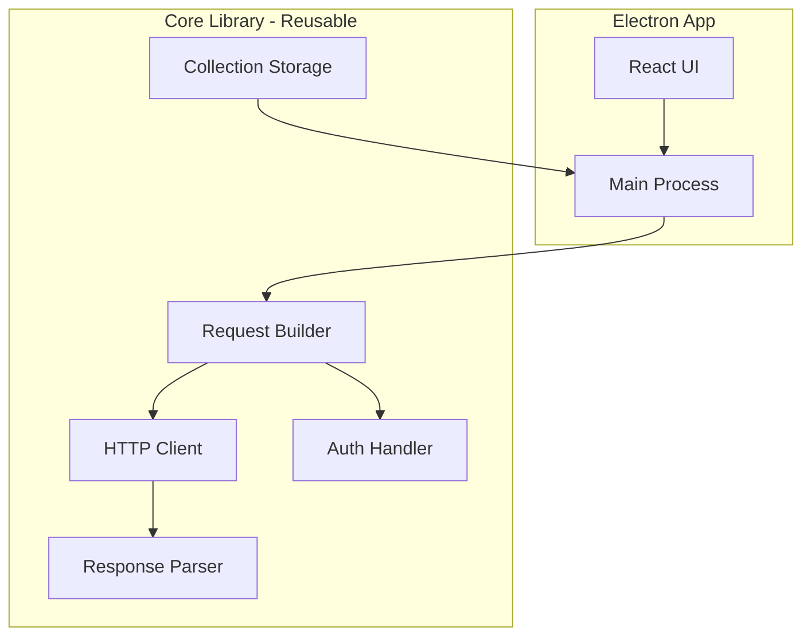

# REST Client Implementation Plan

## Architecture Overview



The **core library** (`src/core/`) will be a standalone TypeScript module with no Electron dependencies, making it reusable for a future VS Code extension.

---

## Project Structure

```
rest-client/
├── package.json
├── tsconfig.json
├── electron-builder.json
├── src/
│   ├── core/                    # Reusable library (no Electron deps)
│   │   ├── index.ts             # Public API exports
│   │   ├── types.ts             # Shared types/interfaces
│   │   ├── request-builder.ts   # Builds request from params
│   │   ├── http-client.ts       # Makes HTTP requests
│   │   ├── auth-handler.ts      # Handles auth types
│   │   ├── response-parser.ts   # Parses/formats responses
│   │   └── storage.ts           # Save/load collections
│   ├── main/                    # Electron main process
│   │   ├── index.ts             # Entry point
│   │   └── ipc-handlers.ts      # IPC bridge to core
│   └── renderer/                # React UI
│       ├── index.html
│       ├── index.tsx
│       ├── App.tsx
│       ├── components/
│       │   ├── RequestPanel/
│       │   │   ├── UrlBar.tsx           # URL + method selector
│       │   │   ├── ParamsTab.tsx        # Query parameters
│       │   │   ├── HeadersTab.tsx       # Request headers
│       │   │   ├── BodyTab.tsx          # Request body
│       │   │   └── AuthTab.tsx          # Authorization config
│       │   ├── ResponsePanel/
│       │   │   ├── ResponseViewer.tsx   # Response display
│       │   │   └── ResponseHeaders.tsx  # Response headers
│       │   └── Sidebar/
│       │       └── Collections.tsx      # Saved requests
│       └── styles/
│           └── main.css
└── collections/                 # Default save location
```

---

## Core Library (`src/core/`)

### Types (`types.ts`)

```typescript
interface HttpRequest {
  url: string;
  method: 'GET' | 'POST' | 'PUT' | 'PATCH' | 'DELETE' | 'HEAD' | 'OPTIONS';
  headers: Record<string, string>;
  queryParams: Array<{ key: string; value: string; enabled: boolean }>;
  body?: { type: 'json' | 'text' | 'form-data'; content: string };
  auth?: AuthConfig;
}

interface AuthConfig {
  type: 'none' | 'basic' | 'bearer' | 'api-key';
  basic?: { username: string; password: string };
  bearer?: { token: string };
  apiKey?: { key: string; value: string; addTo: 'header' | 'query' };
}

interface HttpResponse {
  status: number;
  statusText: string;
  headers: Record<string, string>;
  body: string;
  contentType: string;
  duration: number;
  size: number;
}

interface SavedRequest {
  id: string;
  name: string;
  request: HttpRequest;
  createdAt: string;
}
```

### Request Builder (`request-builder.ts`)

- Combines URL with query parameters
- Merges headers with auth headers
- Returns a ready-to-execute request config

### Auth Handler (`auth-handler.ts`)

- **Basic Auth**: Base64 encode `username:password`, add `Authorization: Basic ...` header
- **Bearer Token**: Add `Authorization: Bearer ...` header
- **API Key**: Add to header or query param based on config

### HTTP Client (`http-client.ts`)

- Uses Node.js `fetch` (built-in since Node 18+)
- Tracks request duration
- Returns structured `HttpResponse`

### Response Parser (`response-parser.ts`)

- Detects content type from headers
- Pretty-prints JSON responses
- Formats XML with indentation
- Returns raw text for HTML/other

### Storage (`storage.ts`)

- Save requests to JSON files in `collections/` folder
- Load/list saved requests
- Simple file-based persistence

---

## Electron Main Process (`src/main/`)

### IPC Handlers (`ipc-handlers.ts`)

Bridge between renderer and core library:

```typescript
// Channels:
'request:send'      // Send HTTP request
'request:save'      // Save request to collection
'request:load'      // Load saved request
'request:list'      // List all saved requests
'request:delete'    // Delete saved request
```

---

## React UI (`src/renderer/`)

### Layout

```
+------------------+----------------------------------------+
|                  |  [GET ▼] [https://api.example.com    ] |
|   Collections    |  [Send]                                |
|   Sidebar        +----------------------------------------+
|                  |  [Params] [Headers] [Body] [Auth]      |
|   - Request 1    |  +------------------------------------+|
|   - Request 2    |  | key        | value       | ☑      ||
|   + New          |  | page       | 1           | ☑      ||
|                  |  +------------------------------------+|
+------------------+----------------------------------------+
|                  |  Response    [200 OK]  [245ms] [1.2KB] |
|                  |  [Body] [Headers]                      |
|                  |  +------------------------------------+|
|                  |  | {                                  ||
|                  |  |   "data": [...]                    ||
|                  |  | }                                  ||
+------------------+----------------------------------------+
```

### Components

**UrlBar** - HTTP method dropdown + URL input + Send button

**ParamsTab** - Key-value table for query parameters with enable/disable toggles

**HeadersTab** - Key-value table for custom headers

**BodyTab** - Text area with format selector (JSON/Text/Form-data)

**AuthTab** - Auth type selector with appropriate input fields for each type

**ResponseViewer** - Syntax-highlighted display with tabs for Body/Headers, status badge, timing, and size

**Collections Sidebar** - List of saved requests with load/delete actions

---

## Build Configuration

### Dependencies

- **electron** - Desktop runtime
- **electron-builder** - Packaging
- **react**, **react-dom** - UI framework
- **typescript** - Type safety
- **vite** - Fast bundling for renderer
- **prismjs** or **highlight.js** - Syntax highlighting for responses

---

## Implementation Order (Testable Milestones)

Each milestone leaves the app in a runnable, testable state.

### Milestone 1: Basic GET Request

- Create `src/core/types.ts` with all interfaces
- Create `src/core/http-client.ts` with basic fetch
- Create `src/main/ipc-handlers.ts` to bridge renderer to core
- Build UI: UrlBar (GET only) + Send button + basic response display
- **Test:** `npm run dev` then `npm start` - make GET request to `https://jsonplaceholder.typicode.com/posts/1`

### Milestone 2: Methods & Headers

- Add HTTP method dropdown to UrlBar
- Create `src/core/request-builder.ts`
- Add Headers tab with key-value table
- **Test:** Make POST request with `Content-Type: application/json` header

### Milestone 3: Query Params

- Add Params tab with key-value table + enable/disable toggles
- Update request builder to append params to URL
- **Test:** Add `?userId=1` param and see it reflected in URL

### Milestone 4: Request Body

- Add Body tab with textarea and type selector (JSON/text)
- Update request builder to include body
- **Test:** POST to `https://jsonplaceholder.typicode.com/posts` with JSON body

### Milestone 5: Authorization

- Create `src/core/auth-handler.ts`
- Add Auth tab with Basic/Bearer/API Key forms
- **Test:** Make request with Bearer token header

### Milestone 6: Response Formatting

- Create `src/core/response-parser.ts` for JSON/XML pretty-print
- Add syntax highlighting to response viewer
- Show response headers tab, status badge, timing, size
- **Test:** See nicely formatted JSON response

### Milestone 7: Collections

- Create `src/core/storage.ts` for file persistence
- Add Collections sidebar with save/load/delete
- **Test:** Save request, close app, reopen, load request

### Milestone 8: Polish

- Refine CSS styling
- Add loading states, error handling polish
- **Test:** Full end-to-end workflow